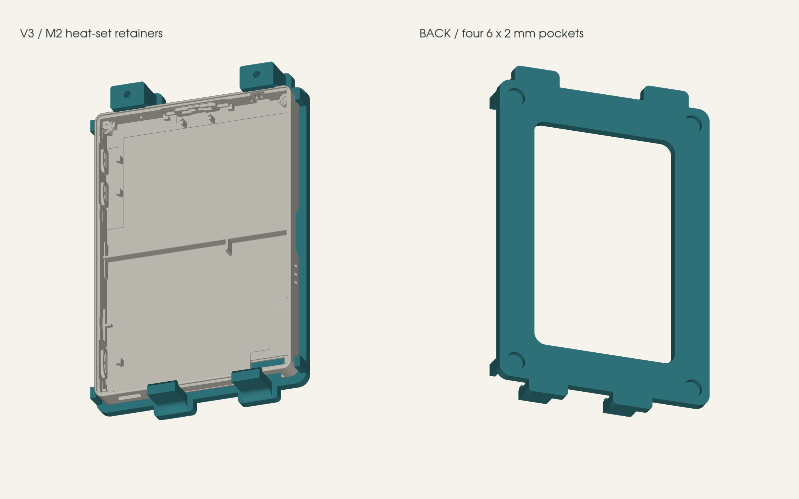

# Fridge cradle for the M5Stack PaperColor

A 3D-printed magnetic cradle that holds the PaperColor on a fridge door with the buttons and
USB-C open. Four 6 × 2 mm magnets on the back, two fixed lower hooks, two screw-down upper
retainers so nothing has to flex over the case.



## Print

Print **`papercolor-fridge-mount-v3-m2-plate.stl`** once at 100 %, millimetres. It holds the base
and both retainers already laid out on the bed. Keep all three flat as supplied; the retainers
print head-face down with their locating recesses up. Or print `papercolor-fridge-mount.stl`
once and `upper-retainer-PRINT-2.stl` twice. The STEP is the assembled model, not a print plate.

Settings that worked on PLA Matte: 0.4 mm nozzle, 0.16 to 0.20 mm layers, five walls, 25 %
infill, normal speed, no supports. Let the plate cool before removing it and do not lever on the
hooks. The optional `magnet-fit-6mm.stl` coupon has 6.2 / 6.3 / 6.4 mm pockets so you can check
your magnets before committing; the mount uses 6.3 mm.

Version history: v1 had four snap clips, and all four cracked about 1 mm above the frame in PLA
Matte. v3 replaces the upper clips with screw-down retainers and widens the lower hook roots.
v3 is CAD-checked and printed; retention on a real fridge over time is still being observed.

## Hardware

- 2 × M2 × 8 mm machine screws (socket or button head; not countersunk, not 10 mm, which bottoms out)
- 2 × M2 heat-set brass inserts, 3.2 mm OD × 4 mm long
- 4 × 6 mm × 2 mm disc magnets, glued into the rear pockets

## Assembly

1. With the board and retainers off, heat-set each insert flush into the hole on top of its post.
   Keep clear of the small locating pins. Let it cool.
2. Glue the magnets against their pocket roofs and let the adhesive cure. Nominal magnet faces sit
   0.1 mm inside the rear surface.
3. Feed the board's lower edge under the two fixed hooks and lower it onto the frame. Do not flex
   the hooks.
4. Set each retainer on its two pins, lip toward the board, and tighten the screws only until the
   retainer seats on its post. The post is the hard stop: the retainer has 0.25 mm clearance over
   the case, so it holds the board in without squeezing the screen.

Remove the two screws to release the board.

## Geometry

Device body 70 × 103 × 8.5 mm (the advertised 70.8 × 103.9 mm includes the protruding controls,
which sit in open space). Case-side clearance 0.35 mm, retaining overlap 0.7 mm, rear frame 3.4 mm,
magnet pockets 6.3 × 2.1 mm. Lower hooks 10 mm wide, 3.2 mm upright, 3 mm rounded root. Retainers
12 mm wide, 2.8 mm thick. Sources: the
[M5Stack spec page](https://docs.m5stack.com/en/core/PaperColor), the
[dimension drawing](https://m5stack-doc.oss-cn-shenzhen.aliyuncs.com/1239/C151PaperColor_model_size.pdf)
and the [official shell STL](https://github.com/m5stack/M5_Hardware/blob/master/Products/C151_PaperColor/Structures/PaperColor.stl)
(not redistributed here).

## Regenerate

`build.py` is the parameter source (CadQuery 2.8, trimesh 5.1):

```sh
python build.py /path/to/PaperColor.stl   # omit the path to skip the shell-intersection check
```

It writes the STLs, the STEP and `validation.json` (watertight meshes, three separate plate parts,
hook-root and hook-tip material, case clearance, screw and insert clearances, optional intersection
with the official shell). Geometric checks only, not strength tests. `explain.py` regenerates the
labelled section `retainer-explained.png`.
